# Banking System

A full-stack banking management system built with Node.js, Express.js, MongoDB, and modern web technologies. The platform supports customers, employees, and administrators through dedicated dashboards, secure authentication, transaction management, loan processing, card services, and fraud detection analytics.

## Key Features

### Customer Portal

* Secure Login & OTP Verification
* Account Dashboard
* Money Transfers
* Bill Payments
* Loan Requests
* Branch Locator

### Employee Portal

* Customer Management
* Loan Processing
* Card Request Management
* Transaction Monitoring
* User Management
* Branch Management
* Analytics Dashboard
* Fraud Detection & Monitoring
* Risk User Analysis

### Security

* Role-Based Access Control
* OTP Verification
* Fraud Detection System
* Risk Analytics

## Tech Stack

**Frontend**

* HTML
* CSS
* JavaScript
* Tailwind CSS

**Backend**

* Node.js
* Express.js

**Database**

* MongoDB

## Project Structure

```text
banking-system/
├── banking-frontend/
├── banking-backend/
└── screenshots/
```

## Project Highlights

### Customer Dashboard

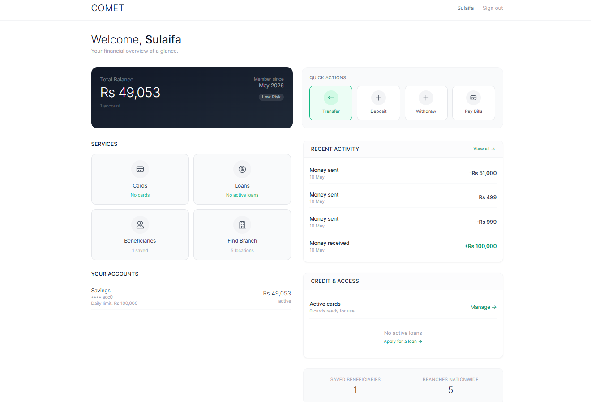

### Employee Dashboard

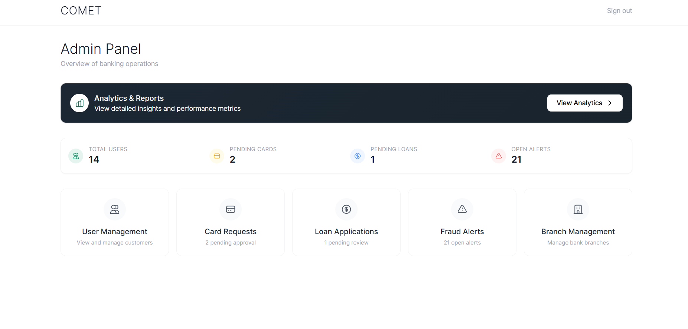

### Admin Analytics

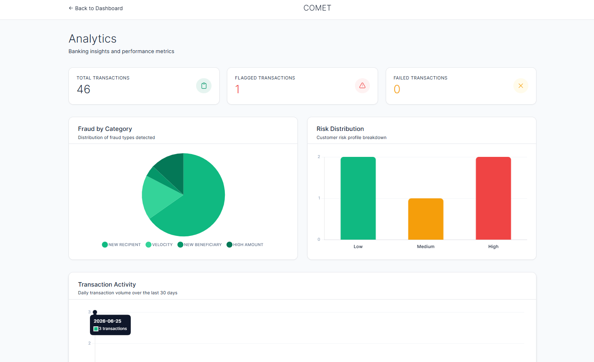

### Fraud Detection System

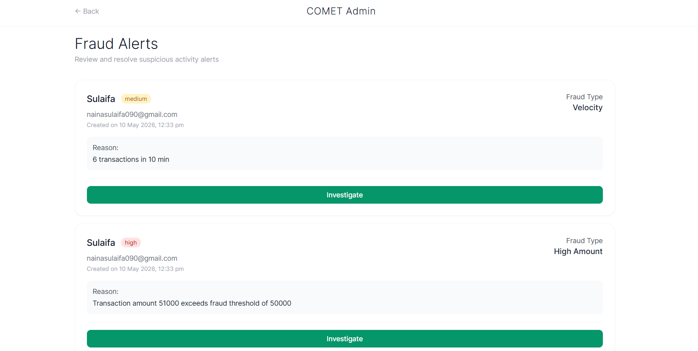

### User Management

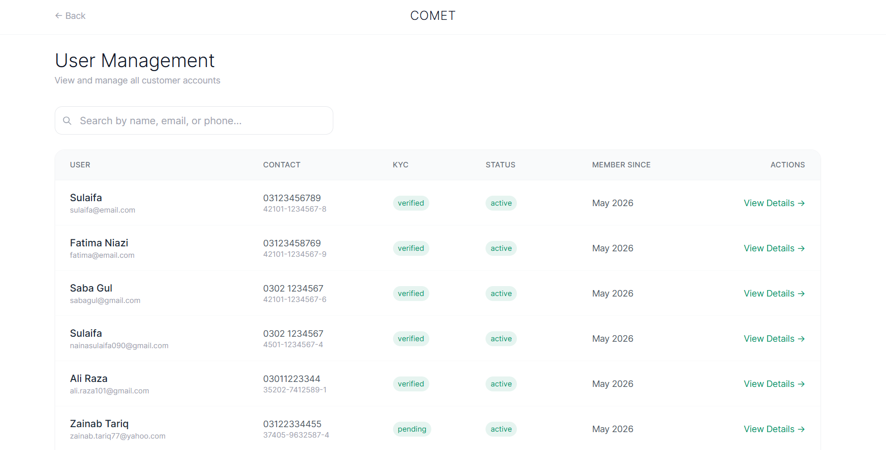

### Money Transfer

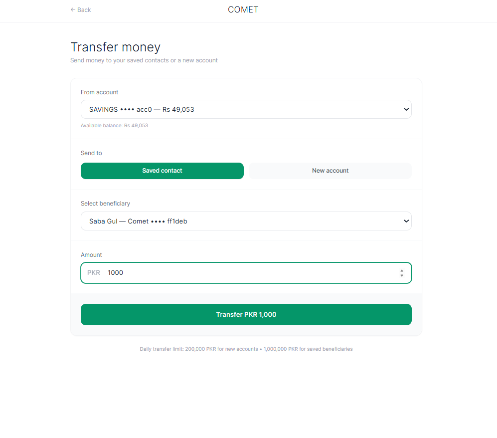

## Additional Screenshots

### Customer Login

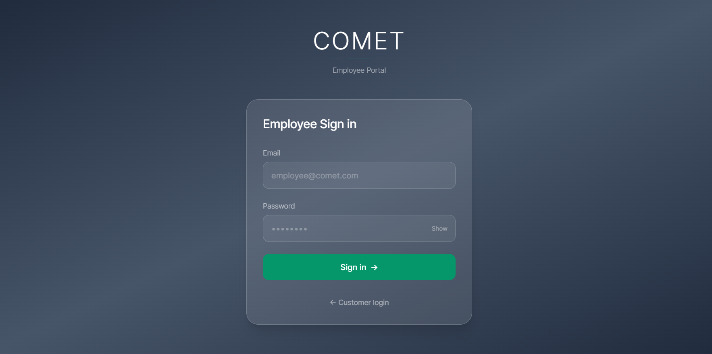

### Employee Login

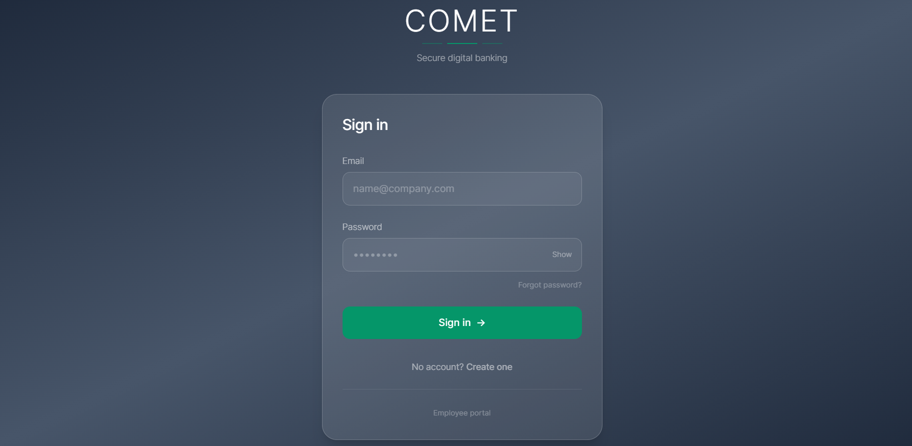

### Branch Management

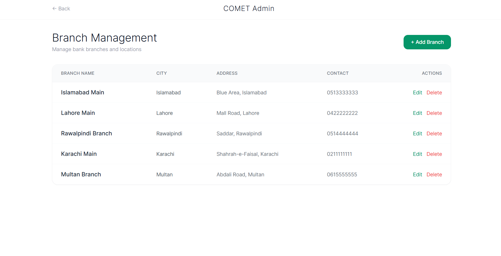

### Card Request Management

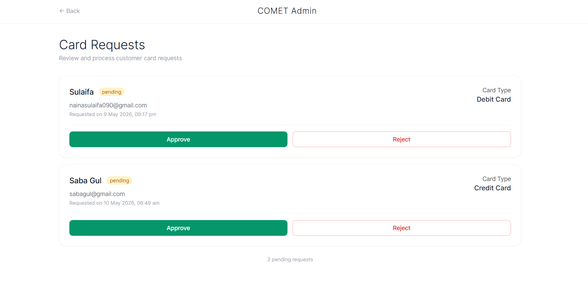

### Loan Management

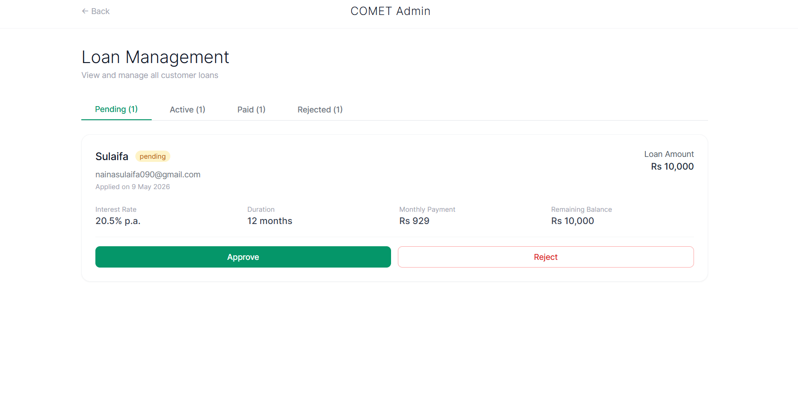

### Risk User Analytics

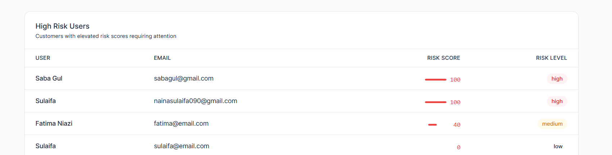

### Bill Payments

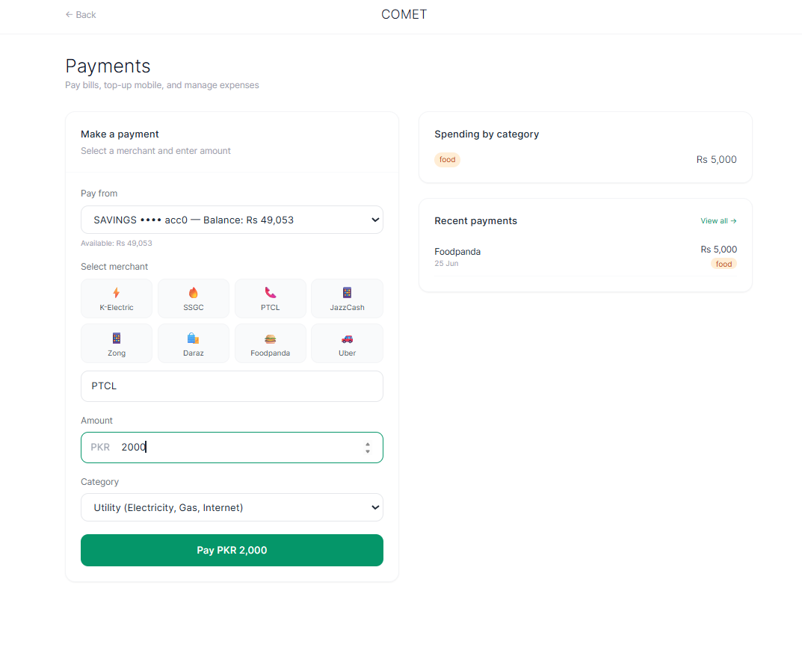

### Loan Requests

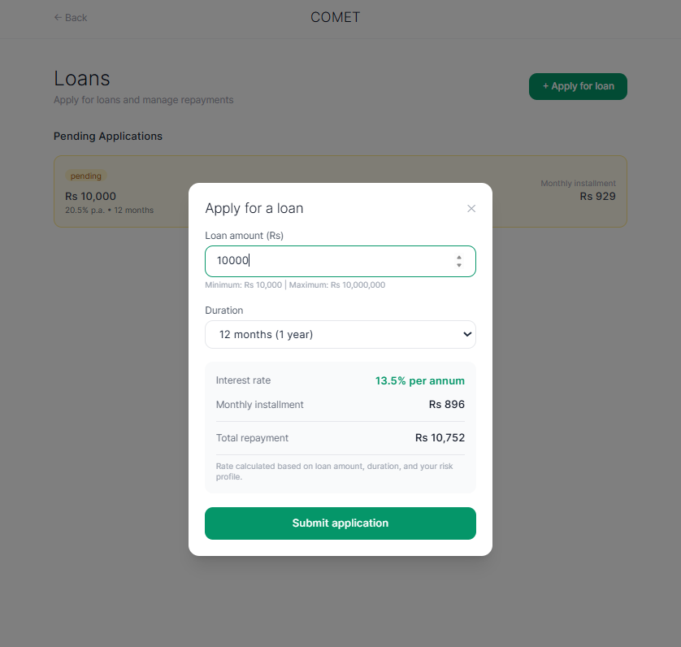

### Create Customer

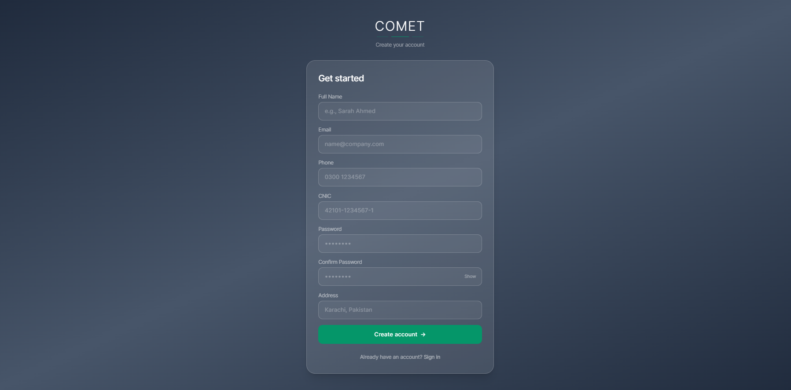

### Branch Locator

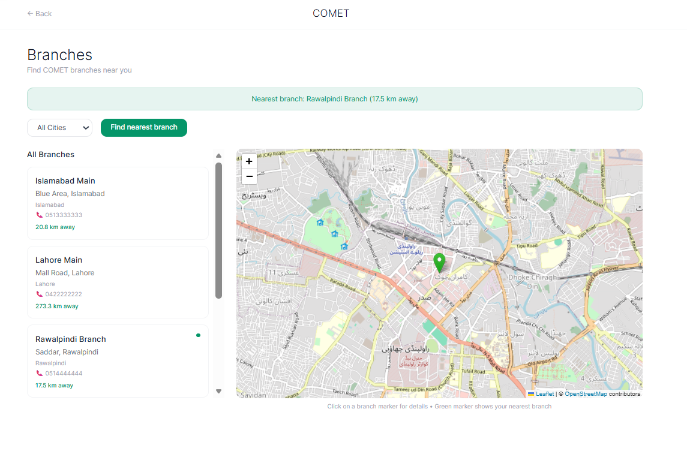

### OTP Verification

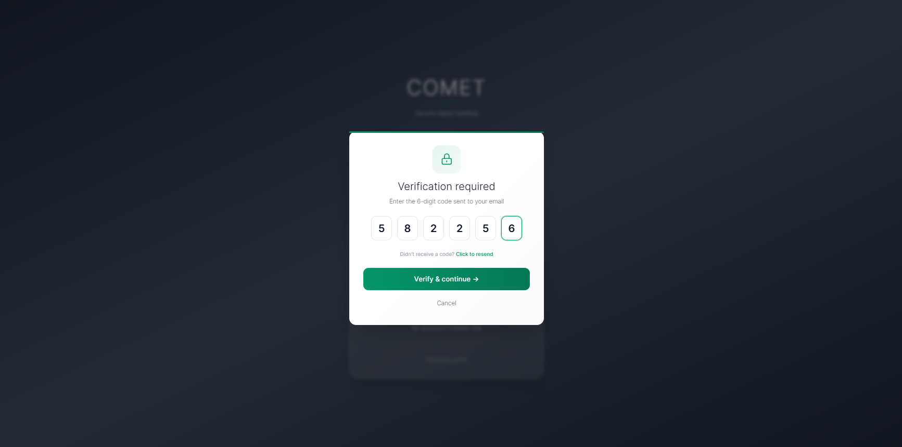

### OTP Code

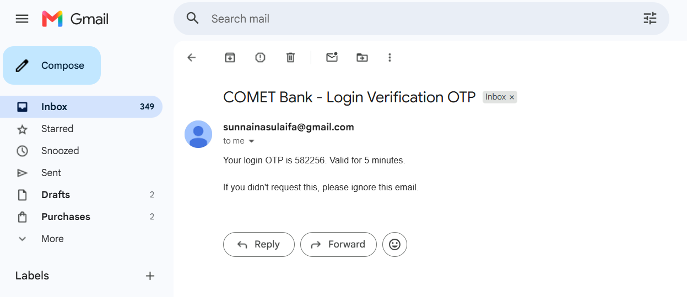

## Future Enhancements

* Real-time transaction monitoring
* Enhanced fraud detection models
* Mobile application support
* Email & SMS notifications
* Advanced reporting and analytics

## Author

**Sulaifa**
